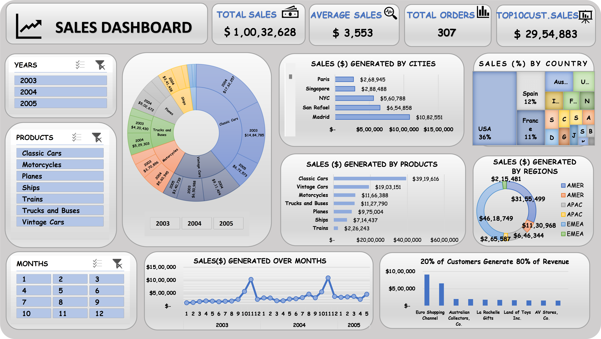

# 📊 Sales Data Analysis Dashboard  

This project provides a **detailed sales analysis** using **Excel dashboards**.  
The dashboard includes **city-wise, product-wise sales insights, top-performing regions, and revenue trends**.  

## 📌 Key Insights  
- **Total Sales:** $10,032,628.85  
- **Best Sales Month:** **November ($2,118,885.67)**  
- **Top 5 Cities by Sales:** Madrid, San Rafael, NYC, Singapore, Paris  
- **Top 5 Countries by Sales:** USA, Spain, France, Australia, UK  
- **Top 20% Customers generate 80% of revenue (Pareto Principle)**  

## 📊 Dashboard Preview  
  

## 📂 File Details  
- `SALES_DATA_ANALYSIS(Dashboard).xlsx` → **Excel file containing the analysis & dashboard**  

## 🚀 How to Use?  
1. **Download the Excel file** from this repository.  
2. **Open it in Microsoft Excel.**  
3. **Explore the dashboard & insights using filters & charts.**  

---
✅ **Made with Excel | Sales Analytics | Data Visualization**
